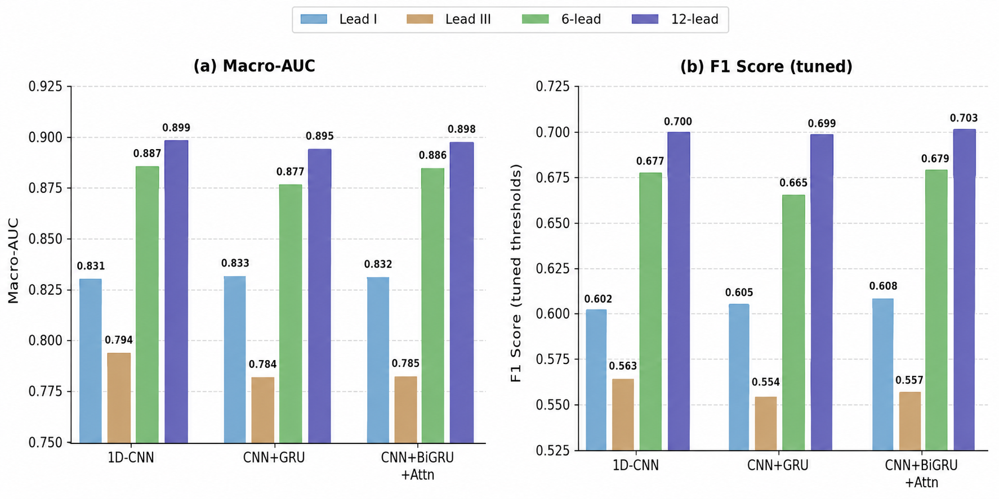
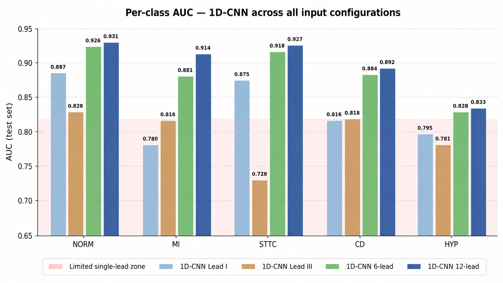
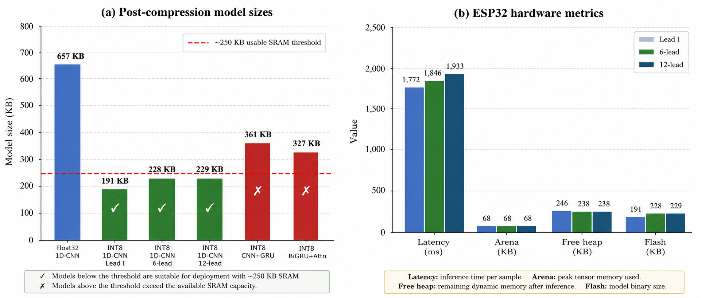
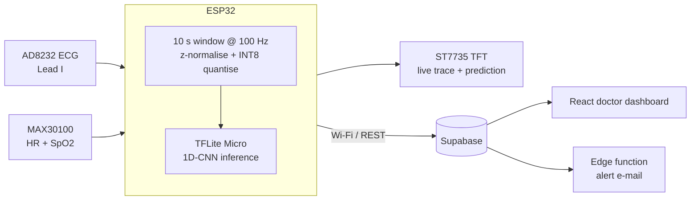
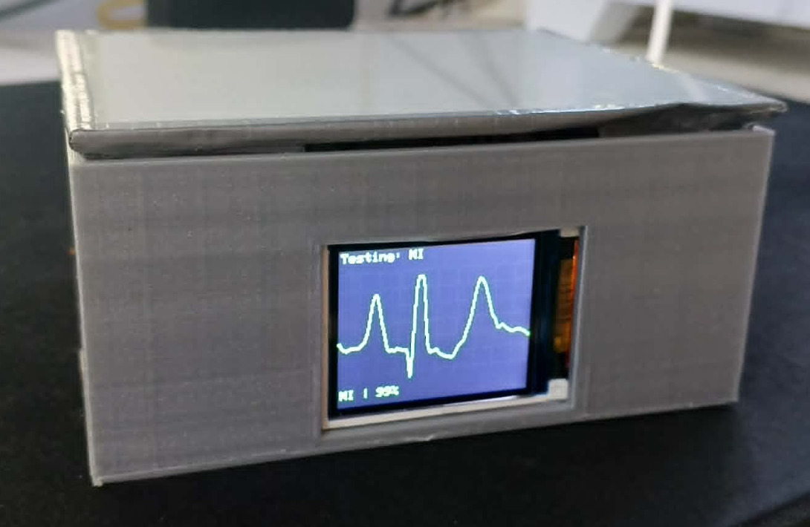
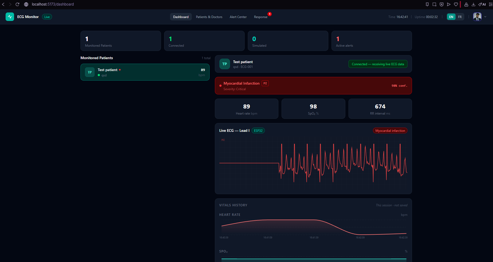

# Real-Time Cardiac Pathology Classification from ECG on ESP32

End-to-end system that classifies five cardiac diagnostic superclasses (NORM, MI, STTC, CD, HYP) from a single-lead (Lead I) ECG, running **on the microcontroller itself**. A 1D-CNN trained on PTB-XL is compressed with quantization-aware training to INT8 (3.4×, 191 KB) and deployed with TensorFlow Lite Micro on an ESP32, which acquires the ECG from an AD8232 front-end and heart rate / SpO₂ from a MAX30100, shows the live trace and prediction on a TFT, and streams vitals to Supabase. A React dashboard lets doctors monitor patients remotely. Three architectures (1D-CNN, CNN+GRU, CNN+BiGRU+Attention) are compared; all reach a macro AUC of about 0.83 on Lead I, which shows that the information content of a single lead, not model complexity, is the limiting factor.

> Master's thesis project: *Deep Learning-Based System for Early Prediction of Heart Attacks Using Medical Data* (ISSAT Mateur, 2026).

## Results

Macro AUC on the PTB-XL test fold (fold 10), float32 models:

| Model              | Lead I | Lead III | 6-lead | 12-lead |
|--------------------|:------:|:--------:|:------:|:-------:|
| 1D-CNN             | 0.831  | 0.794    | 0.887  | 0.899   |
| CNN+GRU            | 0.833  | 0.784    | 0.877  | 0.895   |
| CNN+BiGRU+Attention| 0.832  | 0.785    | 0.886  | 0.898   |





Compression of the deployed Lead-I 1D-CNN (quantization-aware training, INT8):

| Metric                     | Value   |
|----------------------------|---------|
| Float32 model size         | 657 KB  |
| INT8 model size            | 191 KB  |
| Compression ratio          | 3.4×    |
| Macro AUC after INT8 (QAT) | 0.831 (float32: 0.831) |



Only the 1D-CNN can be quantized end to end: PyTorch's QAT does not support GRU layers, so the recurrent models cannot be compressed the same way. Multi-seed results for the 1D-CNN are in [`training/results/`](training/results).

## Architecture



## Hardware

| Part | Role |
|------|------|
| ESP32-WROOM-32D dev board | Acquisition, TFLite Micro inference, Wi-Fi |
| AD8232 ECG front-end + electrodes | Single-lead (Lead I) ECG, lead-off detection |
| MAX30100 pulse oximeter | Heart rate and SpO₂ (I²C) |
| ST7735 1.8" TFT (160×128, SPI) | Live waveform, class label, confidence |

Pin map used by the firmware:

| Signal | GPIO |
|--------|------|
| TFT CS / RST / DC | 5 / 4 / 15 (SPI SCK/MOSI default) |
| AD8232 output | 34 |
| AD8232 LO+ / LO− / SDN | 32 / 33 / 27 |
| MAX30100 SDA / SCL | 21 / 22 |

## Photos and demo

<p align="center">
  
  
</p>

*Left: prototype enclosure, TFT showing on-device classification of a stored PTB-XL MI sample. Right: doctor dashboard receiving live ECG, vitals and the on-device prediction.*

<!-- Demo GIF: add docs/images/demo.gif, then uncomment the line below -->
<!--  -->

## Getting started

### 1. Train

```bash
cd training
python -m venv .venv && source .venv/bin/activate   # Windows: .venv\Scripts\activate
pip install -r requirements.txt
python scripts/download_ptbxl.py                     # PTB-XL from PhysioNet (~1.8 GB)

python src/train.py --model cnn1d          --lead 0 --epochs 30
python src/train.py --model cnn_gru        --lead 0 --epochs 50
python src/train.py --model cnn_bigru_attn --lead 0 --epochs 50

python src/evaluate.py --model cnn1d --lead 0 --ckpt checkpoints/cnn1d_best.pth
python src/convert_to_tflite.py --ckpt checkpoints/cnn1d_best.pth --lead 0   # QAT -> INT8 .tflite + C header
```

`--lead` is `0` (Lead I), `2` (Lead III), `6` (frontal 6-lead) or `12`. Set `PTBXL_DIR` to use a dataset stored elsewhere. The trained INT8 model is already included as `training/deploy/cnn1d_int8.tflite` and `firmware/ecg_inference/cnn1d_model.h`.

### 2. Flash the firmware

1. Install the Arduino IDE (or `arduino-cli`) with the **esp32** board package, and these libraries: `Adafruit GFX`, `Adafruit ST7735 and ST7789`, `ArduinoJson` (v7), `Chirale_TensorFlowLite`, `MAX30100lib`.
2. Create your credentials file:
   ```bash
   cp firmware/ecg_inference/secrets.example.h firmware/ecg_inference/secrets.h
   ```
   Fill in the Wi-Fi SSID/password, Supabase URL, anon key and `DEVICE_ID` (`secrets.h` is gitignored).
3. Open `firmware/ecg_inference/ecg_inference.ino`, select **ESP32 Dev Module** with **Partition Scheme: Huge APP (3MB No OTA)** (the model plus Wi-Fi and TFLite Micro exceed the default partition), and upload.

### 3. Run the dashboard

```bash
cd dashboard
cp .env.example .env        # set VITE_SUPABASE_URL and VITE_SUPABASE_ANON_KEY
npm install
npm run dev                 # production build: npm run build
```

Backend setup: create a Supabase project, apply `dashboard/supabase/migrations/*.sql` (SQL editor or `supabase db push`), and optionally deploy the alert function with `supabase functions deploy send-alert-email` after setting the `RESEND_API_KEY` secret. Register a patient whose `device_id` matches the one in `secrets.h`.

## Repository structure

```
.
├── firmware/ecg_inference/   ESP32 sketch, INT8 model header, secrets.example.h
├── training/
│   ├── src/                  dataset, models, training, evaluation, QAT + TFLite conversion
│   ├── scripts/              PTB-XL download
│   ├── checkpoints/          final PyTorch checkpoints
│   ├── deploy/               ONNX, .tflite and C headers
│   ├── results/              multi-seed CSVs
│   └── requirements.txt
├── dashboard/                React + Vite + Supabase (src/, supabase/)
└── docs/images/              photos, screenshots, demo GIF
```

## Key findings

- **Lead I is the bottleneck, not the architecture.** On Lead I the three models are within 0.002 macro AUC (0.831 / 0.833 / 0.832). Recurrent and attention layers model temporal structure; they cannot recover spatial information that a single lead never recorded.
- **More leads help far more than a bigger model.** Macro AUC rises to ~0.88 with six frontal leads and ~0.90 with twelve, with the largest gains on MI (0.780 → 0.914 from Lead I to 12-lead).
- **Lead III is clearly worse than Lead I** (about −0.04 macro AUC) for every architecture.
- **Compression favours the plain CNN.** QAT shrinks the 1D-CNN 3.4× (657 KB to 191 KB) with no loss of macro AUC (0.831), while GRU-based models cannot be quantized with current PyTorch QAT. The deployed model fits comfortably in ESP32 flash and SRAM.

## Data and licence notes

PTB-XL is not redistributed; download it from [PhysioNet](https://physionet.org/content/ptb-xl/1.0.3/) (CC BY 4.0). This is a research prototype and is not a medical device.

## Author

**Walid Gabtni**: International Research Master's in Cyber-Physical Systems, ISSAT Mateur (University of Carthage).
GitHub: [@WalidGabtni](https://github.com/WalidGabtni)
